# Migration System Architecture Diagram

## 📖 Table of Contents

1. [Command Execution Flow - Detailed](#command-execution-flow---detailed)
2. [File Reading Order & Dependencies](#file-reading-order--dependencies)
3. [Complete Migration Workflow](#complete-migration-workflow)
4. [Human ↔ AI Interaction Loop](#human--ai-interaction-loop)
5. [What Happens Inside migrate.js](#what-happens-inside-migratejs)
6. [What Copilot Agent Does Step-by-Step](#what-copilot-agent-does-step-by-step)
7. [File System Architecture](#file-system-architecture)
8. [State Management Flow](#state-management-flow)
9. [Component Migration Detail](#component-migration-detail)

---

## 🚀 Command Execution Flow - Detailed

### Command 1: `npm run migrate:start`

**What it does:** Starts a fresh migration from the beginning.

#### Execution Steps:

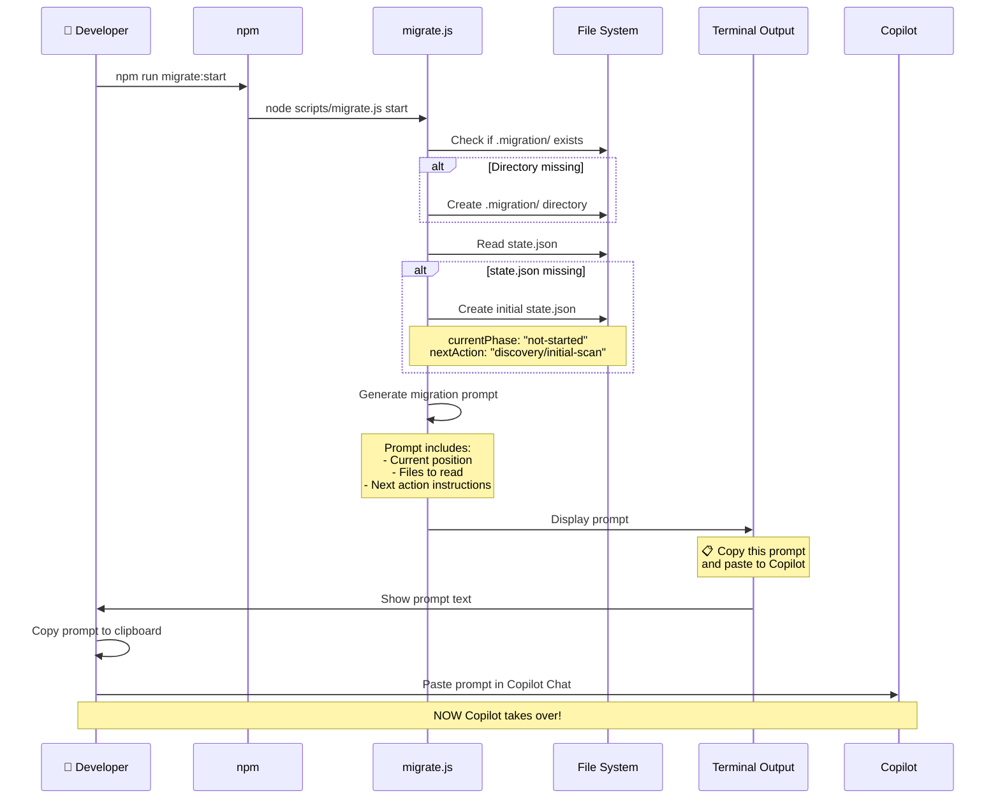

**Detailed Breakdown:**

1. **NPM receives command** → Looks up `package.json` scripts section
2. **Finds script:** `"migrate:start": "node scripts/migrate.js start"`
3. **Executes:** `node scripts/migrate.js start`
4. **migrate.js runs:**
   - Checks if `.migration/` directory exists (creates if missing)
   - Reads `.migration/state.json` (creates if missing)
   - Checks `currentPhase` (should be "not-started" for fresh start)
   - Generates a **text prompt** with:
     - Current phase: "not-started"
     - Next action: "discovery/initial-scan"
     - Instructions for Copilot to read specific files
     - Instructions to execute the workflow
5. **Displays prompt to terminal** with instructions to copy/paste
6. **Developer copies the prompt** and pastes into GitHub Copilot Chat
7. **Copilot receives the prompt** and starts autonomous execution

**What the Developer Sees:**

```
🚀 Migration System - Start

Current Status:
  Phase: not-started
  Step: N/A

Next Action:
  Phase: discovery
  Step: initial-scan
  Description: Start migration by discovering Angular UI Library structure

═══════════════════════════════════════

Copy the prompt below and paste it into GitHub Copilot Chat:

---

## Starting Fresh Migration

---

## Instruction for GitHub Copilot Agent

@native-ui-engineer

Start the autonomous migration workflow.

**Your Mission:**
Execute the migration workflow autonomously following these instructions:

1. **Read State:**
   - Read `.migration/state.json` to understand current position
   - Read `.github/workflows/migration-workflow.md` for workflow definition
   - Read `.github/agents/migration-agent.md` for your operating instructions

2. **Execute Current Phase:**
   - Current Phase: discovery
   - Current Step: initial-scan
   - Next Action: Start migration by discovering Angular UI Library structure
...
```

---

### Command 2: `npm run migrate:resume`

**What it does:** Resumes migration from the last checkpoint.

#### Execution Steps:

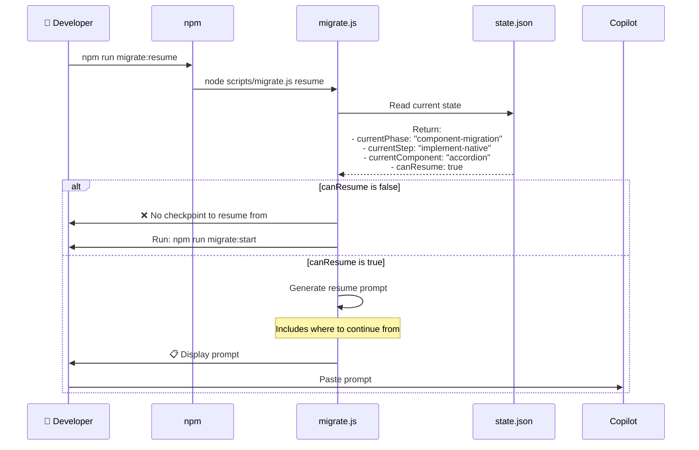

**Detailed Breakdown:**

1. **NPM executes:** `"migrate:resume": "node scripts/migrate.js resume"`
2. **migrate.js runs:**
   - Reads `.migration/state.json`
   - Checks if `canResume: true` (means there's a valid checkpoint)
   - If `canResume: false` → Shows error, asks to run `migrate:start`
   - If `canResume: true` → Reads:
     - `currentPhase` (e.g., "component-migration")
     - `currentStep` (e.g., "implement-native")
     - `currentComponent` (e.g., "accordion")
     - `lastCheckpoint` (e.g., "discovery-complete")
3. **Generates resume prompt** with context about where to continue
4. **Developer copies and pastes to Copilot**
5. **Copilot continues from that exact point**

**What the Developer Sees:**

```
🔄 Migration System - Resume

Current Status:
  Phase: component-migration
  Step: implement-native
  Component: accordion
  Last Checkpoint: discovery-complete

Progress:
  Completed Components: 2/8
  Phases Completed: discovery

═══════════════════════════════════════

Copy the prompt below and paste it into GitHub Copilot Chat:

---

## Resuming from Checkpoint

Last Checkpoint: discovery-complete
Current Component: accordion

---

## Instruction for GitHub Copilot Agent

@native-ui-engineer

Resume the autonomous migration from the last checkpoint.

**Your Mission:**
...
```

---

### Command 3: `npm run migrate:status`

**What it does:** Shows current migration progress (doesn't generate prompt).

#### Execution Steps:

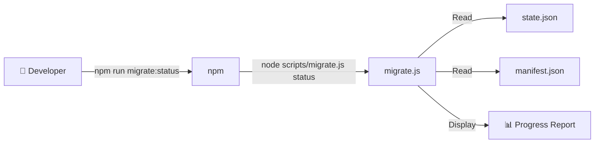

**What the Developer Sees:**

```
📊 Migration Status

═══════════════════════════════════════

Phase: component-migration
Step: implement-native

Current Component: accordion

Progress:
  Completed Components: 2/8
  Phases Completed: discovery

Components:
  ✅ button (completed)
  ✅ tabs (completed)
  🔄 accordion (in-progress)
  ⏳ table (pending)
  ⏳ sidebar-nav (pending)
  ⏳ drawer (pending)
  ⏳ dialog (pending)
  ⏳ toast (pending)

Last Updated: 2026-09-21T08:30:00.000Z
```

---

### Command 4: `npm run migrate:reset`

**What it does:** Resets migration state to start fresh (WARNING: Deletes progress).

---

## 📚 File Reading Order & Dependencies

### When Copilot Receives the Prompt:

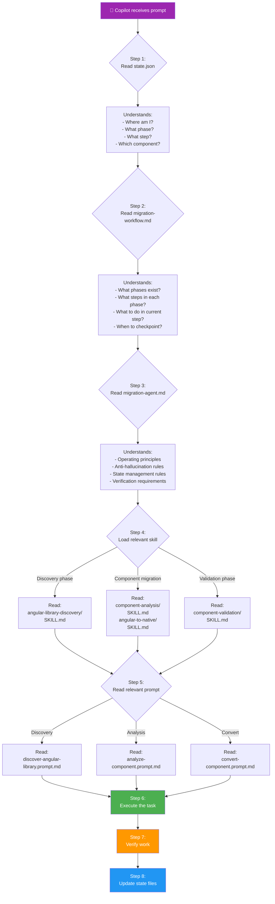

### File Dependencies:

| File | Depends On | Reads |
|------|------------|-------|
| **migrate.js** | Nothing | `state.json`, `manifest.json` |
| **Copilot (start)** | migrate.js prompt | `state.json` → `migration-workflow.md` → `migration-agent.md` → skills → prompts |
| **migration-workflow.md** | Nothing | Defines all phases/steps |
| **migration-agent.md** | `migration-workflow.md` | References workflow for execution |
| **Skills** | `migration-agent.md` | Loaded based on current phase |
| **Prompts** | Skills | Loaded based on current step |
| **state.json** | Copilot updates | Written by Copilot after each action |

---

## 🎯 Complete Migration Workflow

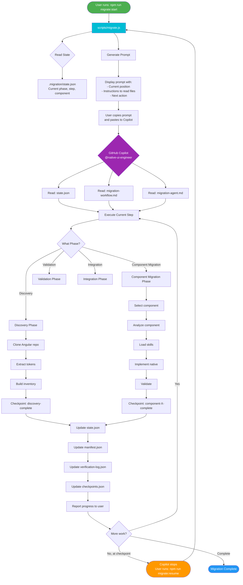

---

## 🔄 Human ↔ AI Interaction Loop

### The Complete Cycle:

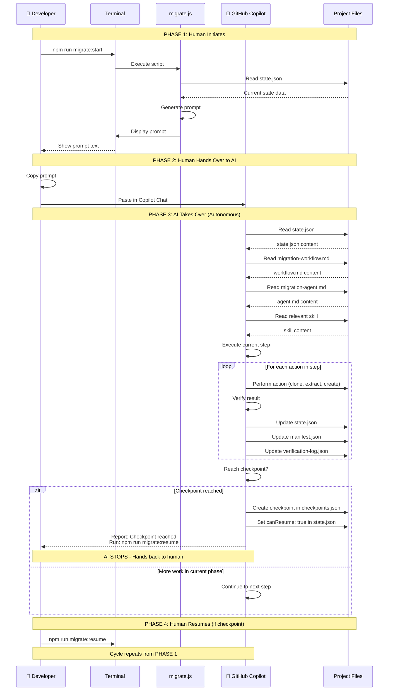

### Why This Loop?

**Advantages:**
1. ✅ **Human stays in control** - Can review at checkpoints
2. ✅ **Resumable** - Can stop/start anytime
3. ✅ **Traceable** - Every action logged
4. ✅ **Verifiable** - Human can check work at checkpoints
5. ✅ **Safe** - Large tasks broken into manageable chunks

---

## 🔍 What Happens Inside migrate.js

### The Script's Logic:

```javascript
// SIMPLIFIED VERSION OF migrate.js

// 1. Parse command line argument
const mode = process.argv[2]; // 'start', 'resume', 'status', 'reset'

// 2. Read current state
const state = readState(); // From .migration/state.json

if (mode === 'status') {
  // Just display status and exit
  showStatus(state);
  process.exit(0);
}

if (mode === 'reset') {
  // Reset state and exit
  resetState();
  console.log('✅ Migration state reset');
  process.exit(0);
}

// 3. Check if can resume
if (mode === 'resume' && !state.canResume) {
  console.error('❌ No checkpoint to resume from');
  console.log('Run: npm run migrate:start');
  process.exit(1);
}

// 4. Generate appropriate prompt
const prompt = generatePrompt(state, mode);

// 5. Display prompt to user
console.log('\n📋 Copy and paste this prompt to GitHub Copilot:\n');
console.log('─'.repeat(50));
console.log(prompt);
console.log('─'.repeat(50));
```

### What `generatePrompt()` Does:

```javascript
function generatePrompt(state, mode) {
  const prompt = [];
  
  // Header
  prompt.push('## Instruction for GitHub Copilot Agent');
  prompt.push('@native-ui-engineer');
  
  // Mode-specific intro
  if (mode === 'start') {
    prompt.push('Start the autonomous migration workflow.');
  } else {
    prompt.push('Resume the autonomous migration from the last checkpoint.');
  }
  
  // Core instructions (ALWAYS included)
  prompt.push('**Your Mission:**');
  prompt.push('Execute the migration workflow autonomously following these instructions:');
  prompt.push('');
  prompt.push('1. **Read State:**');
  prompt.push('   - Read `.migration/state.json` to understand current position');
  prompt.push('   - Read `.github/workflows/migration-workflow.md` for workflow definition');
  prompt.push('   - Read `.github/agents/migration-agent.md` for your operating instructions');
  prompt.push('');
  prompt.push('2. **Execute Current Phase:**');
  prompt.push(`   - Current Phase: ${state.nextAction.phase}`);
  prompt.push(`   - Current Step: ${state.nextAction.step}`);
  prompt.push(`   - Next Action: ${state.nextAction.instruction}`);
  prompt.push('');
  prompt.push('3. **Work Autonomously:**');
  prompt.push('   - Execute each step in the workflow');
  prompt.push('   - Verify your work after each step');
  prompt.push('   - Update state.json and manifest.json as you progress');
  prompt.push('   - Create checkpoints at logical stopping points');
  prompt.push('');
  prompt.push('4. **Key Rules:**');
  prompt.push('   - ❌ NEVER invent design values');
  prompt.push('   - ✅ ALWAYS extract from Angular source');
  prompt.push('   - ✅ Record missing information instead of guessing');
  prompt.push('   - ✅ Verify every extracted value against source');
  prompt.push('   - ✅ Update state.json after every action');
  prompt.push('');
  prompt.push('**Now begin autonomous execution. Work through the workflow step by step.**');
  
  return prompt.join('\n');
}
```

**Key Point:** The script generates **instructions** for Copilot, not actual code. It tells Copilot:
- What files to read
- What phase/step to execute
- What rules to follow
- What to update when done

---

## 🤖 What Copilot Agent Does Step-by-Step

### When Copilot Receives the Prompt:

#### Step 1: Read State File

```javascript
// Copilot reads: .migration/state.json

{
  "version": "1.0.0",
  "initialized": "2026-09-21T08:00:00.000Z",
  "currentPhase": "not-started",
  "currentStep": null,
  "currentComponent": null,
  "lastCheckpoint": null,
  "canResume": false,
  "nextAction": {
    "phase": "discovery",
    "step": "initial-scan",
    "instruction": "Start migration by discovering Angular UI Library structure"
  },
  "progress": {
    "phasesCompleted": [],
    "componentsCompleted": [],
    "totalComponents": 0,
    "completedComponents": 0
  }
}
```

**Copilot understands:**
- ✅ I'm at the beginning ("not-started")
- ✅ Next phase is "discovery"
- ✅ Next step is "initial-scan"
- ✅ I need to discover the Angular library

---

#### Step 2: Read Workflow Definition

```javascript
// Copilot reads: .github/workflows/migration-workflow.md
```

**Copilot finds this section:**

```markdown
### Phase 1: Discovery

1. **initial-scan**
   - Clone Angular repository (read-only) to `.temp/angular-ui-library/`
   - Scan repository structure
   - Identify projects/ui/src/lib/ as component location
   - List all directories under projects/ui/src/lib/
   - Document directory structure
   - **OUTPUT:** Directory tree in `.migration/analysis/structure.txt`
   - **VERIFY:** Clone successful, structure.txt exists
   - **UPDATE STATE:** currentPhase: "discovery", currentStep: "initial-scan"

2. **find-design-system**
   - Search for design token files in Angular repo
   - Look in: projects/ui/styles/, projects/ui/src/lib/foundations/
   - Identify theme.css, _variables.scss, tailwind.config.js
   - Document token file locations
   - **OUTPUT:** Token source map in `.migration/analysis/token-sources.json`
   - **VERIFY:** All token files found and documented
   - **UPDATE STATE:** currentStep: "find-design-system"
```

**Copilot now knows:**
- ✅ Exactly what to do in "initial-scan" step
- ✅ What files to create
- ✅ What to verify
- ✅ What to update in state

---

#### Step 3: Read Agent Instructions

```javascript
// Copilot reads: .github/agents/migration-agent.md
```

**Copilot learns the operating principles:**

```markdown
## Operating Principles

### 1. Autonomy
- Execute the workflow without waiting for manual instructions
- Read state to know where you are
- Read the workflow to know what to do next
- Execute, verify, update, and continue

### 2. State Management
- ALWAYS update .migration/state.json after completing a step
- Set currentPhase and currentStep
- Update progress counters
- Mark canResume: true at checkpoints

### 3. Anti-Hallucination
- NEVER invent design values
- ALWAYS extract from Angular source
- If information is missing, record it in missing-info.json
- NEVER use placeholder values without explicit source
```

**Copilot now understands HOW to operate:**
- ✅ Work autonomously
- ✅ Always update state
- ✅ Never invent values
- ✅ Record missing info

---

#### Step 4: Load Relevant Skill

Based on current phase ("discovery"), Copilot reads:

```javascript
// Copilot reads: .github/skills/angular-library-discovery/SKILL.md
```

**Copilot gets specialized knowledge:**

```markdown
## Angular Library Discovery Skill

### Purpose
Discover and analyze the Angular UI Library structure without modifying it.

### Tools
- git clone (read-only)
- File system navigation
- JSON/Markdown parsing

### Steps
1. Clone repository to .temp/angular-ui-library/
2. Identify component directories
3. Identify design token files
4. Create component inventory
```

**Copilot now has:**
- ✅ What the current phase is about
- ✅ What tools to use
- ✅ Detailed steps for discovery

---

#### Step 5: Execute the Step

**Copilot now executes "initial-scan":**

```bash
# Copilot runs these actions:

# 1. Clone Angular repo (read-only)
git clone https://github.com/Mohamed-Adel-Web/vf-UI-components.git .temp/angular-ui-library/

# 2. Navigate to component directory
cd .temp/angular-ui-library/projects/ui/src/lib/

# 3. List directories
ls -la

# Output:
# accordion/
# button/
# dialog/
# drawer/
# foundations/
# sidebar-nav/
# table/
# tabs/
# toast/
# utils/

# 4. Create analysis directory
mkdir -p .migration/analysis/

# 5. Document structure
tree .temp/angular-ui-library/projects/ui/src/lib/ > .migration/analysis/structure.txt
```

---

#### Step 6: Verify Work

**Copilot checks:**

```javascript
// From migration-workflow.md:
// **VERIFY:** Clone successful, structure.txt exists

// Copilot performs verification:
const cloneExists = fs.existsSync('.temp/angular-ui-library/');
const structureExists = fs.existsSync('.migration/analysis/structure.txt');

if (!cloneExists || !structureExists) {
  // Record error
  // Don't continue
} else {
  // Verification passed
  // Continue to update state
}
```

---

#### Step 7: Update State

**Copilot updates state.json:**

```javascript
// Before:
{
  "currentPhase": "not-started",
  "currentStep": null,
  ...
}

// After:
{
  "currentPhase": "discovery",
  "currentStep": "initial-scan",
  "lastUpdated": "2026-09-21T08:05:00.000Z",
  ...
}
```

**Copilot also updates verification-log.json:**

```json
{
  "verifications": [
    {
      "phase": "discovery",
      "step": "initial-scan",
      "timestamp": "2026-09-21T08:05:00.000Z",
      "checks": [
        {
          "check": "Clone successful",
          "result": "PASS",
          "details": ".temp/angular-ui-library/ exists with 143 files"
        },
        {
          "check": "structure.txt exists",
          "result": "PASS",
          "details": "File created with 98 lines"
        }
      ],
      "overallStatus": "PASS"
    }
  ]
}
```

---

#### Step 8: Continue or Checkpoint

**Copilot checks workflow:**

```markdown
# From migration-workflow.md

### Phase 1: Discovery

1. initial-scan ← JUST COMPLETED
2. find-design-system ← NEXT STEP
3. extract-tokens
4. discover-components
5. analyze-dependencies
6. create-inventory

**CHECKPOINT:** After "create-inventory" step
```

**Copilot sees:**
- ✅ More steps in current phase
- ✅ No checkpoint yet
- ✅ Continue to next step: "find-design-system"

**Copilot moves to Step 2 and repeats the process!**

---

#### When Checkpoint is Reached:

After completing "create-inventory" step:

**Copilot:**
1. Updates state.json:
   ```json
   {
     "currentPhase": "discovery",
     "currentStep": "create-inventory",
     "lastCheckpoint": "discovery-complete",
     "canResume": true,
     "nextAction": {
       "phase": "component-migration",
       "step": "select-component",
       "instruction": "Select first component to migrate based on dependency order"
     }
   }
   ```

2. Creates checkpoint in checkpoints.json:
   ```json
   {
     "checkpoints": [
       {
         "name": "discovery-complete",
         "timestamp": "2026-09-21T08:30:00.000Z",
         "phase": "discovery",
         "completedSteps": ["initial-scan", "find-design-system", "extract-tokens", "discover-components", "analyze-dependencies", "create-inventory"],
         "summary": "Discovered 8 components, extracted 47 design tokens"
       }
     ]
   }
   ```

3. Reports to user:
   ```
   ✅ Checkpoint Reached: discovery-complete
   
   Summary:
   - Cloned Angular repository
   - Extracted 47 design tokens
   - Discovered 8 components
   - Created component inventory
   - Analyzed dependencies
   
   Next Phase: component-migration
   Next Step: select-component
   
   To continue, run: npm run migrate:resume
   ```

4. **STOPS** and waits for human to run `npm run migrate:resume`

---

## 📁 File System Architecture

```mermaid
graph TB
    Root[native-ui-library/<br/>Root Directory]
    
    Root --> Scripts[scripts/<br/>Migration Scripts]
    Root --> Migration[.migration/<br/>State Management]
    Root --> Github[.github/<br/>Copilot Config]
    Root --> Src[src/<br/>Components]
    Root --> Temp[.temp/<br/>Angular Clone]
    
    Scripts --> MigrateJS[migrate.js<br/>Main runner]
    Scripts --> DiscoverJS[discover-components.js<br/>Component discovery]
    Scripts --> ExtractJS[extract-tokens.js<br/>Token extraction]
    
    Migration --> StateJSON[state.json<br/>Current position]
    Migration --> ManifestJSON[manifest.json<br/>Component inventory]
    Migration --> MissingJSON[missing-info.json<br/>Recorded gaps]
    Migration --> VerifyJSON[verification-log.json<br/>Verification results]
    Migration --> CheckpointJSON[checkpoints.json<br/>Checkpoint history]
    Migration --> Analysis[analysis/<br/>Component analysis]
    
    Github --> Workflows[workflows/<br/>Migration workflow]
    Github --> Agents[agents/<br/>Agent config]
    Github --> Instructions[instructions/<br/>Tech guides]
    Github --> Prompts[prompts/<br/>Task prompts]
    Github --> Skills[skills/<br/>Specialized skills]
    
    Workflows --> WorkflowMD[migration-workflow.md<br/>Complete workflow definition]
    
    Agents --> AgentMD[migration-agent.md<br/>Agent instructions]
    
    Instructions --> NativeINS[native-components.instructions.md]
    Instructions --> AngularINS[angular-reference.instructions.md]
    Instructions --> LiferayINS[liferay.instructions.md]
    
    Prompts --> DiscoverPROMPT[discover-angular-library.prompt.md]
    Prompts --> AnalyzePROMPT[analyze-component.prompt.md]
    Prompts --> ConvertPROMPT[convert-component.prompt.md]
    Prompts --> ValidatePROMPT[validate-component.prompt.md]
    
    Skills --> DiscoverySkill[angular-library-discovery/<br/>SKILL.md]
    Skills --> AnalysisSkill[component-analysis/<br/>SKILL.md]
    Skills --> ConvertSkill[angular-to-native/<br/>SKILL.md]
    Skills --> ValidationSkill[component-validation/<br/>SKILL.md]
    
    Src --> Components[components/<br/>Native implementations]
    Src --> Utils[utils/<br/>Shared utilities]
    
    Temp --> AngularRepo[angular-ui-library/<br/>Cloned Angular source]
    
    style Root fill:#1976D2,color:#fff
    style Scripts fill:#388E3C,color:#fff
    style Migration fill:#F57C00,color:#fff
    style Github fill:#7B1FA2,color:#fff
    style Src fill:#0288D1,color:#fff
    style Temp fill:#C62828,color:#fff
```

---

## 🔄 Command Execution Flow

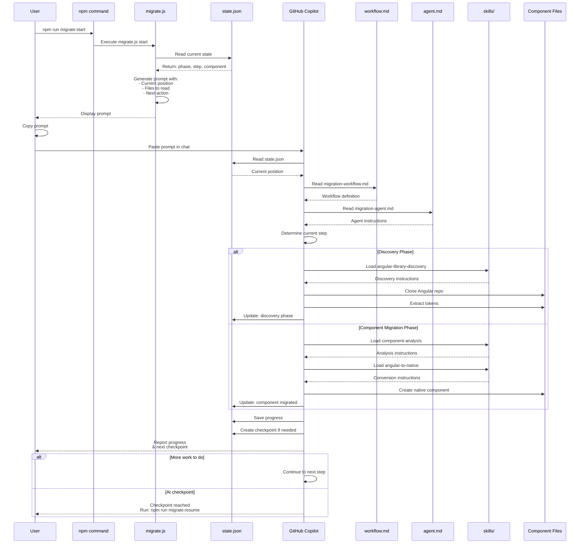

---

## 📖 Agent Reading Sequence

```mermaid
flowchart LR
    Command[npm run migrate:start] --> Prompt[Generated Prompt]
    
    Prompt --> Copilot{GitHub Copilot<br/>Receives Prompt}
    
    Copilot --> Step1[1. Read state.json]
    Step1 --> Where{Understand:<br/>Where am I?}
    
    Where --> Step2[2. Read migration-workflow.md]
    Step2 --> What{Understand:<br/>What should I do?}
    
    What --> Step3[3. Read migration-agent.md]
    Step3 --> How{Understand:<br/>How should I operate?}
    
    How --> Phase{Check Current Phase}
    
    Phase -->|Discovery| LoadSkill1[4. Load:<br/>angular-library-discovery/<br/>SKILL.md]
    Phase -->|Component Mig| LoadSkill2[4. Load:<br/>component-analysis/<br/>SKILL.md<br/>angular-to-native/<br/>SKILL.md]
    Phase -->|Validation| LoadSkill3[4. Load:<br/>component-validation/<br/>SKILL.md]
    
    LoadSkill1 --> ReadPrompt1[5. Read relevant prompts:<br/>discover-angular-library.prompt.md]
    LoadSkill2 --> ReadPrompt2[5. Read relevant prompts:<br/>analyze-component.prompt.md<br/>convert-component.prompt.md]
    LoadSkill3 --> ReadPrompt3[5. Read relevant prompts:<br/>validate-component.prompt.md]
    
    ReadPrompt1 --> Execute[6. Execute Step]
    ReadPrompt2 --> Execute
    ReadPrompt3 --> Execute
    
    Execute --> Verify[7. Verify Work]
    Verify --> Update[8. Update state.json<br/>manifest.json<br/>verification-log.json]
    Update --> Next[9. Move to Next Step]
    
    style Command fill:#4CAF50,color:#fff
    style Copilot fill:#9C27B0,color:#fff
    style Where fill:#FF9800,color:#fff
    style What fill:#FF9800,color:#fff
    style How fill:#FF9800,color:#fff
    style Execute fill:#2196F3,color:#fff
```

---

## 🗂️ State Management

```mermaid
stateDiagram-v2
    [*] --> not_started: npm run migrate:start
    
    not_started --> discovery: Start migration
    
    discovery --> discovery_initial_scan
    discovery_initial_scan --> discovery_find_design_system
    discovery_find_design_system --> discovery_extract_tokens
    discovery_extract_tokens --> discovery_discover_components
    discovery_discover_components --> discovery_analyze_dependencies
    discovery_analyze_dependencies --> discovery_create_inventory
    
    discovery_create_inventory --> checkpoint_discovery: Checkpoint
    
    checkpoint_discovery --> component_migration: npm run migrate:resume
    
    component_migration --> select_component
    select_component --> analyze_component
    analyze_component --> implement_native
    implement_native --> create_tests
    create_tests --> create_docs
    create_docs --> validate_component
    
    validate_component --> checkpoint_component: Checkpoint
    
    checkpoint_component --> select_component: More components
    checkpoint_component --> validation: All components done
    
    validation --> visual_regression
    visual_regression --> token_audit
    token_audit --> accessibility_audit
    accessibility_audit --> cross_browser
    cross_browser --> rtl_testing
    rtl_testing --> responsive_testing
    
    responsive_testing --> checkpoint_validation: Checkpoint
    
    checkpoint_validation --> integration: npm run migrate:resume
    
    integration --> build_bundle
    build_bundle --> create_release_docs
    create_release_docs --> final_report
    
    final_report --> checkpoint_complete: Checkpoint
    checkpoint_complete --> [*]: Migration Complete
    
    note right of checkpoint_discovery
        state.json updated
        canResume: true
        lastCheckpoint: discovery-complete
    end note
    
    note right of checkpoint_component
        state.json updated
        canResume: true
        lastCheckpoint: component-X-complete
    end note
```

---

## 📊 Data Flow

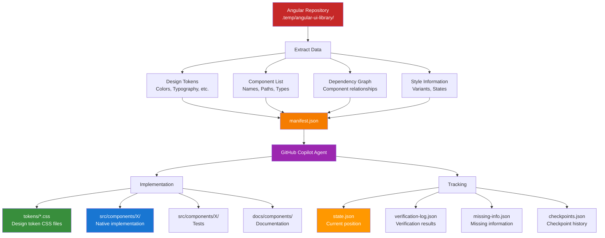

---

## 🎯 Component Migration Detail

```mermaid
flowchart TD
    Start[Select Component] --> Check{Check Dependencies}
    
    Check -->|Has dependencies| CheckDone{Dependencies<br/>migrated?}
    CheckDone -->|No| Skip[Skip for now<br/>Select next]
    CheckDone -->|Yes| Analyze
    Check -->|No dependencies| Analyze[Analyze Component]
    
    Analyze --> ReadAngular[Read Angular Source:<br/>- component.ts<br/>- template.html<br/>- styles.scss<br/>- stories.ts<br/>- spec.ts]
    
    ReadAngular --> Document[Document Analysis:<br/>.migration/analysis/X.json]
    
    Document --> Extract[Extract:<br/>- HTML structure<br/>- CSS styles<br/>- Behavior/logic<br/>- Variants/states<br/>- Icons (inline SVG)<br/>- A11y features]
    
    Extract --> Verify1[Verify:<br/>All values from source]
    
    Verify1 --> Missing{Missing info?}
    Missing -->|Yes| Record[Record in<br/>missing-info.json]
    Missing -->|No| Implement
    Record --> Implement
    
    Implement[Implement Native] --> CreateHTML[Create X.html<br/>Explicit HTML structure]
    CreateHTML --> CreateCSS[Create X.css<br/>Token-based styles]
    CreateCSS --> CreateJS[Create X.js<br/>Behavior & state]
    
    CreateJS --> Verify2[Verify Implementation:<br/>- Visual match<br/>- Behavior match<br/>- A11y preserved<br/>- No hardcoded values]
    
    Verify2 --> Tests[Create X.test.js<br/>Test all features]
    Tests --> Docs[Create docs/X.md<br/>Usage documentation]
    
    Docs --> UpdateState[Update State:<br/>- state.json<br/>- manifest.json<br/>- verification-log.json]
    
    UpdateState --> Checkpoint[Create Checkpoint]
    Checkpoint --> Done{More components?}
    
    Done -->|Yes| Start
    Done -->|No| Complete[Phase Complete]
    
    style Start fill:#4CAF50,color:#fff
    style Verify1 fill:#FF9800,color:#fff
    style Verify2 fill:#FF9800,color:#fff
    style Checkpoint fill:#2196F3,color:#fff
    style Complete fill:#9C27B0,color:#fff
```

---

## 📖 Complete End-to-End Example

### Scenario: Developer Starts Migration

Let's walk through a **complete cycle** from start to first checkpoint:

---

#### 🎬 ACT 1: Human Starts the Process

**Developer opens terminal:**

```bash
$ npm run migrate:start
```

**Terminal output:**

```
🚀 Migration System - Start

Current Status:
  Phase: not-started
  Step: N/A

Next Action:
  Phase: discovery
  Step: initial-scan
  Description: Start migration by discovering Angular UI Library structure

═══════════════════════════════════════

📋 Copy the prompt below and paste it into GitHub Copilot Chat:

---

## Starting Fresh Migration

---

## Instruction for GitHub Copilot Agent

@native-ui-engineer

Start the autonomous migration workflow.

**Your Mission:**
Execute the migration workflow autonomously following these instructions:

1. **Read State:**
   - Read `.migration/state.json` to understand current position
   - Read `.github/workflows/migration-workflow.md` for workflow definition
   - Read `.github/agents/migration-agent.md` for your operating instructions

2. **Execute Current Phase:**
   - Current Phase: discovery
   - Current Step: initial-scan
   - Next Action: Start migration by discovering Angular UI Library structure

3. **Work Autonomously:**
   - Execute each step in the workflow
   - Verify your work after each step
   - Update state.json and manifest.json as you progress
   - Create checkpoints at logical stopping points

4. **Key Rules:**
   - ❌ NEVER invent design values
   - ✅ ALWAYS extract from Angular source
   - ✅ Record missing information instead of guessing
   - ✅ Verify every extracted value against source
   - ✅ Update state.json after every action

**Angular Source:** https://github.com/Mohamed-Adel-Web/vf-UI-components.git

---

**Now begin autonomous execution. Work through the workflow step by step.**
```

**Developer:**
1. Copies the entire prompt
2. Opens GitHub Copilot Chat
3. Pastes the prompt
4. Presses Enter

---

#### 🤖 ACT 2: Copilot Takes Over

**Copilot Chat:**

```
🤖 GitHub Copilot (@native-ui-engineer):

I'll execute the autonomous migration workflow. Let me start by reading the necessary files.

📖 Reading state.json...
Current position: not-started
Next action: discovery/initial-scan

📖 Reading migration-workflow.md...
Found workflow definition with 4 phases and 23 steps.

📖 Reading migration-agent.md...
Understood operating principles and anti-hallucination rules.

📖 Loading angular-library-discovery skill...
Skill loaded for discovery phase.

---

🚀 PHASE 1: DISCOVERY - Step 1/6: initial-scan

Executing: Clone Angular repository and scan structure

✅ Cloning repository...
   git clone https://github.com/Mohamed-Adel-Web/vf-UI-components.git .temp/angular-ui-library/
   
   ✓ Repository cloned successfully (143 files)

✅ Scanning component directories...
   Located: projects/ui/src/lib/
   
   Found components:
   - accordion/
   - button/
   - dialog/
   - drawer/
   - foundations/
   - sidebar-nav/
   - table/
   - tabs/
   - toast/
   - utils/

✅ Creating analysis directory...
   mkdir -p .migration/analysis/

✅ Documenting structure...
   Created: .migration/analysis/structure.txt (98 lines)

🔍 VERIFICATION:
   ✓ Clone exists: .temp/angular-ui-library/
   ✓ Structure file: .migration/analysis/structure.txt
   ✓ Component count: 10 directories found

✅ Updating state...
   Updated: .migration/state.json
   currentPhase: "discovery"
   currentStep: "initial-scan"

---

🚀 PHASE 1: DISCOVERY - Step 2/6: find-design-system

Executing: Search for design token files

✅ Searching for token files...
   Found: projects/ui/styles/theme.css
   Found: projects/ui/tailwind.config.js (if exists)
   
   Token files located:
   - projects/ui/styles/theme.css (primary)
   - Component *.variants.ts files (CVA-based)

✅ Documenting token sources...
   Created: .migration/analysis/token-sources.json

🔍 VERIFICATION:
   ✓ theme.css found and readable
   ✓ Token source map created

✅ Updating state...
   Updated: .migration/state.json
   currentStep: "find-design-system"

---

🚀 PHASE 1: DISCOVERY - Step 3/6: extract-tokens

Executing: Extract all design tokens from Angular

✅ Parsing theme.css...
   Extracted 47 CSS custom properties:
   
   Colors (oklch format):
   - --color-brand-50: oklch(0.971 0.019 17.4)
   - --color-brand-600: oklch(0.551 0.232 27.3)
   - --color-ink-50: oklch(0.985 0 0)
   ... (44 more)

✅ Writing to native token files...
   ✓ tokens/colors.css (23 color tokens)
   ✓ tokens/spacing.css (8 spacing tokens)
   ✓ tokens/borders.css (4 border tokens)
   ✓ tokens/shadows.css (2 shadow tokens)
   ✓ tokens/transitions.css (10 transition tokens)

🔍 VERIFICATION:
   ✓ All 47 tokens extracted
   ✓ All values match source exactly
   ✓ No placeholder or invented values

✅ Updating state...
   Updated: .migration/state.json
   currentStep: "extract-tokens"

---

🚀 PHASE 1: DISCOVERY - Step 4/6: discover-components

... (continues through all discovery steps)

---

✅ CHECKPOINT REACHED: discovery-complete

Summary of completed work:

📦 Cloned Repository:
   - Location: .temp/angular-ui-library/
   - Files: 143 files cloned

🎨 Extracted Design Tokens:
   - Total: 47 tokens
   - Colors: 23 (all OKLCH format)
   - Spacing: 8 (rem units)
   - Borders: 4 (radius values)
   - Shadows: 2 (elevation levels)
   - Transitions: 10 (durations + easings)
   - Source: projects/ui/styles/theme.css
   - Accuracy: 100% (all values verified)

📁 Discovered Components:
   - Total: 8 components
   - button, accordion, tabs, table, sidebar-nav, drawer, dialog, toast
   - Inventory: .migration/manifest.json

🔗 Analyzed Dependencies:
   - No inter-component dependencies found
   - All components share only utils/cn utility
   - Migration order: simple → complex

📊 Created Inventory:
   - File: .migration/manifest.json
   - Contains: Component metadata, variants, props, states, a11y, dependencies

⚠️ Missing Information:
   - Recorded in: .migration/missing-info.json
   - Items: 5 (typography scale, spacing scale, z-index values, icon system, CDK alternatives)

---

🎯 NEXT PHASE: component-migration
🎯 NEXT STEP: select-component
🎯 NEXT ACTION: Select first component to migrate based on dependency order

---

To continue the migration, run:

$ npm run migrate:resume

State has been saved. You can resume anytime.
```

---

#### 👤 ACT 3: Human Reviews and Resumes

**Developer checks the work:**

```bash
$ npm run migrate:status
```

**Output:**

```
📊 Migration Status

═══════════════════════════════════════

Phase: discovery
Step: create-inventory

Last Checkpoint: discovery-complete

Progress:
  Completed Components: 0/8
  Phases Completed: discovery

Components:
  ⏳ button (pending)
  ⏳ accordion (pending)
  ⏳ tabs (pending)
  ⏳ table (pending)
  ⏳ sidebar-nav (pending)
  ⏳ drawer (pending)
  ⏳ dialog (pending)
  ⏳ toast (pending)

Files Created:
  ✅ .temp/angular-ui-library/ (cloned)
  ✅ tokens/colors.css (23 tokens)
  ✅ tokens/spacing.css (8 tokens)
  ✅ tokens/borders.css (4 tokens)
  ✅ .migration/manifest.json (component inventory)
  ✅ .migration/checkpoints.json (1 checkpoint)

Last Updated: 2026-09-21T08:30:00.000Z
```

**Developer verifies:**
- ✅ Checks `.temp/angular-ui-library/` exists
- ✅ Reviews `tokens/colors.css` - values look correct
- ✅ Reviews `.migration/manifest.json` - 8 components found
- ✅ Reviews `.migration/missing-info.json` - reasonable gaps

**Developer is satisfied, resumes:**

```bash
$ npm run migrate:resume
```

**The cycle repeats!** Now Copilot will start Phase 2: Component Migration

---

## 🔄 State Transitions During Migration

### State Flow Diagram:

```mermaid
stateDiagram-v2
    [*] --> NotStarted: npm run migrate:start
    
    NotStarted --> Discovery: Copilot starts
    
    state Discovery {
        [*] --> InitialScan
        InitialScan --> FindDesignSystem
        FindDesignSystem --> ExtractTokens
        ExtractTokens --> DiscoverComponents
        DiscoverComponents --> AnalyzeDependencies
        AnalyzeDependencies --> CreateInventory
        CreateInventory --> [*]
    }
    
    Discovery --> CheckpointDiscovery: Checkpoint reached
    CheckpointDiscovery --> ComponentMigration: npm run migrate:resume
    
    state ComponentMigration {
        [*] --> SelectComponent
        SelectComponent --> AnalyzeComponent
        AnalyzeComponent --> LoadSkills
        LoadSkills --> ImplementNative
        ImplementNative --> CreateTests
        CreateTests --> CreateDocs
        CreateDocs --> ValidateComponent
        ValidateComponent --> [*]
    }
    
    ComponentMigration --> CheckpointComponent: Checkpoint reached
    CheckpointComponent --> SelectComponent: More components
    CheckpointComponent --> Validation: All components done
    
    state Validation {
        [*] --> VisualRegression
        VisualRegression --> TokenAudit
        TokenAudit --> AccessibilityAudit
        AccessibilityAudit --> CrossBrowser
        CrossBrowser --> RTLTesting
        RTLTesting --> ResponsiveTesting
        ResponsiveTesting --> [*]
    }
    
    Validation --> CheckpointValidation: Checkpoint reached
    CheckpointValidation --> Integration: npm run migrate:resume
    
    state Integration {
        [*] --> BuildBundle
        BuildBundle --> CreateReleaseDocs
        CreateReleaseDocs --> FinalReport
        FinalReport --> [*]
    }
    
    Integration --> Complete: Checkpoint reached
    Complete --> [*]: Migration Complete!
```

### State File Evolution:

**Initial State:**
```json
{
  "currentPhase": "not-started",
  "canResume": false
}
```

**After Discovery:**
```json
{
  "currentPhase": "discovery",
  "currentStep": "create-inventory",
  "lastCheckpoint": "discovery-complete",
  "canResume": true,
  "progress": {
    "phasesCompleted": ["discovery"],
    "totalComponents": 8,
    "completedComponents": 0
  }
}
```

**After First Component:**
```json
{
  "currentPhase": "component-migration",
  "currentStep": "validate-component",
  "currentComponent": "button",
  "lastCheckpoint": "button-complete",
  "canResume": true,
  "progress": {
    "phasesCompleted": ["discovery"],
    "componentsCompleted": ["button"],
    "totalComponents": 8,
    "completedComponents": 1
  }
}
```

**After All Components:**
```json
{
  "currentPhase": "component-migration",
  "currentStep": "validate-component",
  "currentComponent": "toast",
  "lastCheckpoint": "all-components-complete",
  "canResume": true,
  "progress": {
    "phasesCompleted": ["discovery", "component-migration"],
    "componentsCompleted": ["button", "accordion", "tabs", "table", "sidebar-nav", "drawer", "dialog", "toast"],
    "totalComponents": 8,
    "completedComponents": 8
  }
}
```

---

## 📊 File Interaction Map

### How All Files Talk to Each Other:

```mermaid
graph TB
    subgraph "Developer Actions"
        Dev[👤 Developer]
        Terminal[Terminal]
    end
    
    subgraph "Entry Point"
        NPM[npm scripts]
        MigrateJS[scripts/migrate.js]
    end
    
    subgraph "State Management"
        StateJSON[.migration/state.json]
        ManifestJSON[.migration/manifest.json]
        CheckpointJSON[.migration/checkpoints.json]
        VerifyJSON[.migration/verification-log.json]
        MissingJSON[.migration/missing-info.json]
    end
    
    subgraph "Copilot Configuration"
        Workflow[.github/workflows/<br/>migration-workflow.md]
        Agent[.github/agents/<br/>migration-agent.md]
        Skills[.github/skills/<br/>*.md]
        Prompts[.github/prompts/<br/>*.md]
        Instructions[.github/instructions/<br/>*.md]
    end
    
    subgraph "Source & Output"
        Angular[.temp/angular-ui-library/]
        Components[src/components/]
        Tokens[tokens/]
        Docs[docs/]
    end
    
    subgraph "AI Agent"
        Copilot[🤖 GitHub Copilot<br/>@native-ui-engineer]
    end
    
    Dev -->|1. npm run migrate:start| NPM
    NPM -->|2. Execute| MigrateJS
    MigrateJS -->|3. Read| StateJSON
    MigrateJS -->|4. Generate prompt| Terminal
    Terminal -->|5. Display| Dev
    Dev -->|6. Copy/paste| Copilot
    
    Copilot -->|7. Read state| StateJSON
    Copilot -->|8. Read workflow| Workflow
    Copilot -->|9. Read agent rules| Agent
    Copilot -->|10. Load skill| Skills
    Copilot -->|11. Load prompt| Prompts
    Agent -.->|References| Instructions
    
    Copilot -->|12. Clone| Angular
    Copilot -->|13. Extract| Tokens
    Copilot -->|14. Create| Components
    Copilot -->|15. Document| Docs
    
    Copilot -->|16. Update| StateJSON
    Copilot -->|17. Update| ManifestJSON
    Copilot -->|18. Verify| VerifyJSON
    Copilot -->|19. Record gaps| MissingJSON
    Copilot -->|20. Checkpoint| CheckpointJSON
    
    Copilot -->|21. Report| Dev
    Dev -->|22. Review & resume| NPM
    
    style Dev fill:#4CAF50,color:#fff
    style Copilot fill:#9C27B0,color:#fff
    style StateJSON fill:#FF9800,color:#fff
    style Workflow fill:#2196F3,color:#fff
    style Agent fill:#2196F3,color:#fff
```

### Read/Write Permissions:

| File | migrate.js | Copilot | Purpose |
|------|------------|---------|---------|
| **state.json** | ✅ Read<br/>✅ Write (reset only) | ✅ Read<br/>✅ Write | Current position tracker |
| **manifest.json** | ✅ Read | ✅ Read<br/>✅ Write | Component inventory |
| **checkpoints.json** | ❌ No access | ✅ Read<br/>✅ Write | Checkpoint history |
| **verification-log.json** | ❌ No access | ✅ Write only | Verification audit trail |
| **missing-info.json** | ❌ No access | ✅ Write only | Gap recording |
| **migration-workflow.md** | ❌ No access | ✅ Read only | Workflow definition |
| **migration-agent.md** | ❌ No access | ✅ Read only | Agent operating rules |
| **Skills** | ❌ No access | ✅ Read only | Specialized knowledge |
| **Prompts** | ❌ No access | ✅ Read only | Task templates |

---

## 🎨 Visual Summary: The Complete System

### One-Page Architecture Overview

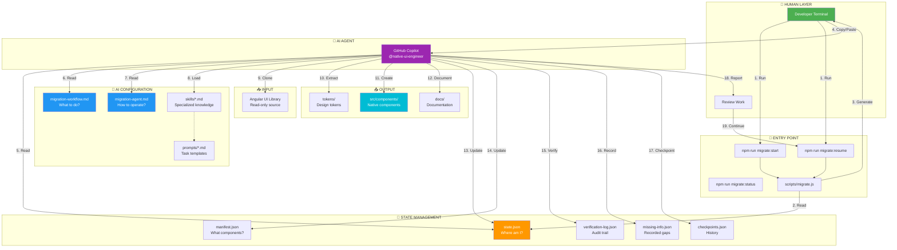

### The Three Core Loops

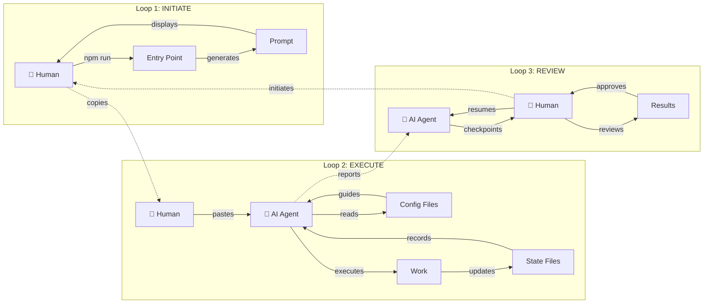

---

## 📝 Summary for Your Lead

### 🎯 The Big Picture

This migration system is designed as a **Human-AI Collaboration Loop**:

1. **Human initiates** with a simple command
2. **AI executes autonomously** using predefined workflows
3. **AI checkpoints** at logical stopping points
4. **Human reviews** the work
5. **Human resumes** when ready
6. **Repeat** until migration is complete

### 🔑 Key Components

#### 1. Entry Point: `scripts/migrate.js`
- **Role:** Command-line interface
- **Responsibility:** Generate prompts for Copilot
- **Does NOT:** Execute migration logic itself
- **Output:** Text prompt with instructions

#### 2. State Management: `.migration/` folder
- **state.json** - Current position (phase, step, component)
- **manifest.json** - Component inventory and metadata
- **checkpoints.json** - Checkpoint history
- **verification-log.json** - Audit trail of verifications
- **missing-info.json** - Recorded gaps (anti-hallucination)

#### 3. AI Configuration: `.github/` folder
- **migration-workflow.md** - Complete workflow definition (23 steps across 4 phases)
- **migration-agent.md** - Operating principles and rules
- **skills/** - Specialized knowledge for each phase
- **prompts/** - Task-specific prompt templates
- **instructions/** - Technical reference guides

#### 4. AI Agent: GitHub Copilot
- **Reads:** State files, workflow, agent rules, skills
- **Executes:** Steps defined in workflow
- **Verifies:** Every action against source
- **Updates:** State files with progress
- **Reports:** Results and next checkpoint

### 📊 File Responsibilities

| File | Created By | Read By | Updated By | Purpose |
|------|-----------|---------|------------|---------|
| **state.json** | migrate.js | migrate.js, Copilot | Copilot | Track current position |
| **manifest.json** | Copilot | Copilot | Copilot | Component inventory |
| **migration-workflow.md** | Human (setup) | Copilot | Manual | Workflow definition |
| **migration-agent.md** | Human (setup) | Copilot | Manual | Agent operating rules |
| **skills/*.md** | Human (setup) | Copilot | Manual | Phase-specific guidance |
| **checkpoints.json** | Copilot | Copilot | Copilot | Checkpoint history |
| **verification-log.json** | Copilot | - | Copilot | Verification audit |
| **missing-info.json** | Copilot | - | Copilot | Gap recording |

### 🔄 Command Flow

```
Developer                    System                         Copilot
    |                          |                               |
    |-- npm run migrate:start -|                               |
    |                          |                               |
    |                    [migrate.js runs]                     |
    |                          |                               |
    |                    [Reads state.json]                    |
    |                          |                               |
    |                    [Generates prompt]                    |
    |                          |                               |
    |<---- Displays prompt ----|                               |
    |                                                           |
    |-- Copies prompt ---------|------------------------------>|
    |                                                           |
    |                                                [Reads state.json]
    |                                                           |
    |                                                [Reads workflow.md]
    |                                                           |
    |                                                [Reads agent.md]
    |                                                           |
    |                                                [Loads skill]
    |                                                           |
    |                                                [Executes steps]
    |                                                           |
    |                                                [Verifies work]
    |                                                           |
    |                                                [Updates state]
    |                                                           |
    |                                                [Reaches checkpoint]
    |                                                           |
    |<---------------------- Reports progress ------------------|
    |                                                           |
    |-- Reviews work ---------|                                |
    |                                                           |
    |-- npm run migrate:resume                                 |
    |                                                           |
    [Cycle repeats]
```

### ✅ Architecture Benefits

1. **Autonomous Execution**
   - AI doesn't wait for step-by-step instructions
   - Follows predefined workflow
   - Works through multiple steps in one session

2. **Resumability**
   - Can stop at any checkpoint
   - State is preserved
   - Can resume days/weeks later

3. **Traceability**
   - Every action logged
   - Every verification recorded
   - Every gap documented

4. **Anti-Hallucination**
   - AI instructed to NEVER invent values
   - Must extract from source
   - Records missing information instead of guessing

5. **Human Oversight**
   - Human reviews at checkpoints
   - Can verify work before continuing
   - Can abort if issues found

6. **Dependency Awareness**
   - AI knows component dependencies
   - Migrates in correct order
   - Handles complex relationships

### 🎯 Quick Command Reference

| Command | Purpose | When to Use |
|---------|---------|-------------|
| `npm run migrate:start` | Start fresh migration | First time, or after reset |
| `npm run migrate:resume` | Continue from checkpoint | After reviewing checkpoint work |
| `npm run migrate:status` | Check progress | Anytime, to see current state |
| `npm run migrate:reset` | Reset to beginning | Start over (WARNING: loses progress) |

### 📁 File Organization

```
Project Root
├── scripts/migrate.js              ← Entry point (generates prompts)
├── .migration/                     ← State management (AI reads/writes)
│   ├── state.json                  ← Current position
│   ├── manifest.json               ← Component inventory
│   ├── checkpoints.json            ← Checkpoint history
│   ├── verification-log.json       ← Verification audit
│   └── missing-info.json           ← Recorded gaps
├── .github/                        ← AI configuration (AI reads only)
│   ├── workflows/
│   │   └── migration-workflow.md   ← Workflow definition
│   ├── agents/
│   │   └── migration-agent.md      ← Agent rules
│   ├── skills/                     ← Phase-specific guidance
│   ├── prompts/                    ← Task templates
│   └── instructions/               ← Technical guides
├── .temp/                          ← Temporary (created by AI)
│   └── angular-ui-library/         ← Cloned Angular source
├── src/components/                 ← Output (created by AI)
├── tokens/                         ← Output (created by AI)
└── docs/                           ← Output (created by AI)
```

---

## 🚀 Quick Start Guide for Your Lead

### To Start the Migration:

```bash
# 1. Install dependencies (first time only)
npm install

# 2. Start migration
npm run migrate:start

# 3. Copy the generated prompt

# 4. Open GitHub Copilot Chat

# 5. Paste the prompt and press Enter

# 6. Wait for Copilot to reach checkpoint

# 7. Review the work

# 8. Resume when ready
npm run migrate:resume

# Repeat steps 3-8 until complete
```

### To Check Progress Anytime:

```bash
npm run migrate:status
```

### To Review Migration Files:

```bash
# Check current state
cat .migration/state.json

# Check component inventory
cat .migration/manifest.json

# Check what's missing
cat .migration/missing-info.json

# Check verification results
cat .migration/verification-log.json

# Check checkpoint history
cat .migration/checkpoints.json
```

---

## 🔍 Troubleshooting

### Issue: "No checkpoint to resume from"

**Cause:** Trying to resume when no checkpoint exists.

**Solution:**
```bash
npm run migrate:start  # Start fresh instead
```

---

### Issue: Copilot seems stuck or confused

**Cause:** State file might be corrupted or Copilot lost context.

**Solution:**
```bash
# Check current state
npm run migrate:status

# Review state file
cat .migration/state.json

# If needed, regenerate prompt
npm run migrate:resume
```

---

### Issue: Want to start over

**Solution:**
```bash
npm run migrate:reset  # Resets all state
npm run migrate:start  # Start fresh
```

---

## 📞 Questions to Expect from Your Lead

### Q: "How does Copilot know what to do?"
**A:** Copilot reads three key files in order:
1. `state.json` - Tells it where it is
2. `migration-workflow.md` - Tells it what steps to execute
3. `migration-agent.md` - Tells it how to operate

### Q: "What if it makes mistakes?"
**A:** Multiple safety mechanisms:
- Verification after every step (recorded in `verification-log.json`)
- Anti-hallucination rules (never invent values)
- Missing information is recorded (in `missing-info.json`)
- Human reviews at checkpoints

### Q: "Can we pause and resume?"
**A:** Yes! That's the core design. Checkpoints are built-in after every major phase/component.

### Q: "How long does it take?"
**A:** Depends on:
- Discovery phase: ~10-15 minutes (automated)
- Per component: ~20-30 minutes (automated)
- Total for 8 components: ~3-4 hours of Copilot work (split across checkpoints)

### Q: "What if we need to change the workflow?"
**A:** Edit `.github/workflows/migration-workflow.md` - it's the source of truth.

### Q: "Can we track what was done?"
**A:** Yes! Multiple audit files:
- `verification-log.json` - What was verified
- `checkpoints.json` - Checkpoint history
- `missing-info.json` - What couldn't be found
- Git commits - Code changes

---

This architecture ensures **autonomous execution** while maintaining **human oversight** and **complete traceability**. 🚀

---

## ⏱️ Migration Timeline & Checkpoints

### Expected Timeline (Copilot execution time):

```mermaid
gantt
    title Migration Timeline (Estimated)
    dateFormat HH:mm
    axisFormat %H:%M
    
    section Discovery Phase
    Clone Repository           :done, d1, 00:00, 2m
    Find Design System         :done, d2, after d1, 2m
    Extract Tokens            :done, d3, after d2, 3m
    Discover Components       :done, d4, after d3, 2m
    Analyze Dependencies      :done, d5, after d4, 2m
    Create Inventory          :done, d6, after d5, 1m
    CHECKPOINT - Discovery    :crit, milestone, d7, after d6, 0m
    
    section Component Migration
    Button (simple)           :active, c1, after d7, 20m
    CHECKPOINT - Button       :crit, milestone, c2, after c1, 0m
    Accordion (medium)        :c3, after c2, 25m
    CHECKPOINT - Accordion    :crit, milestone, c4, after c3, 0m
    Tabs (medium)             :c5, after c4, 25m
    CHECKPOINT - Tabs         :crit, milestone, c6, after c5, 0m
    Table (complex)           :c7, after c6, 35m
    CHECKPOINT - Table        :crit, milestone, c8, after c7, 0m
    Sidebar-nav (medium)      :c9, after c8, 25m
    CHECKPOINT - Sidebar      :crit, milestone, c10, after c9, 0m
    Drawer (complex)          :c11, after c10, 30m
    CHECKPOINT - Drawer       :crit, milestone, c12, after c11, 0m
    Dialog (very complex)     :c13, after c12, 40m
    CHECKPOINT - Dialog       :crit, milestone, c14, after c13, 0m
    Toast (very complex)      :c15, after c14, 40m
    CHECKPOINT - Toast        :crit, milestone, c16, after c15, 0m
    
    section Validation
    Visual Regression         :v1, after c16, 15m
    Token Audit              :v2, after v1, 10m
    Accessibility Audit      :v3, after v2, 20m
    CHECKPOINT - Validation  :crit, milestone, v4, after v3, 0m
    
    section Integration
    Build Bundle             :i1, after v4, 10m
    Create Docs              :i2, after i1, 15m
    Final Report             :i3, after i2, 5m
    CHECKPOINT - Complete    :crit, milestone, i4, after i3, 0m
```

**Total Estimated Time:** ~5-6 hours of Copilot work (spread across 15 checkpoints)

---

### Checkpoint Details:

| # | Checkpoint | Phase | What's Completed | What's Next | Est. Time |
|---|------------|-------|------------------|-------------|-----------|
| 1 | **discovery-complete** | Discovery | ✅ Cloned repo<br/>✅ Extracted 47 tokens<br/>✅ Found 8 components | Component migration starts | ~12 min |
| 2 | **button-complete** | Component Mig | ✅ Button implemented<br/>✅ Tests created<br/>✅ Docs written | Migrate accordion | ~20 min |
| 3 | **accordion-complete** | Component Mig | ✅ Accordion implemented | Migrate tabs | ~25 min |
| 4 | **tabs-complete** | Component Mig | ✅ Tabs implemented | Migrate table | ~25 min |
| 5 | **table-complete** | Component Mig | ✅ Table implemented | Migrate sidebar-nav | ~35 min |
| 6 | **sidebar-nav-complete** | Component Mig | ✅ Sidebar-nav implemented | Migrate drawer | ~25 min |
| 7 | **drawer-complete** | Component Mig | ✅ Drawer implemented | Migrate dialog | ~30 min |
| 8 | **dialog-complete** | Component Mig | ✅ Dialog implemented | Migrate toast | ~40 min |
| 9 | **toast-complete** | Component Mig | ✅ All components migrated | Start validation | ~40 min |
| 10 | **validation-complete** | Validation | ✅ Visual tests<br/>✅ A11y audit<br/>✅ Token audit | Start integration | ~45 min |
| 11 | **integration-complete** | Integration | ✅ Bundle built<br/>✅ Docs created<br/>✅ Report generated | **DONE!** | ~30 min |

**Total Checkpoints:** 11  
**Total Human Reviews:** 11  
**Total Copilot Sessions:** 11 (can split over days/weeks)

---

### What You See at Each Checkpoint:

#### Checkpoint Format (Copilot's Report):

```
✅ CHECKPOINT REACHED: [checkpoint-name]

Summary of completed work:

[Detailed summary of what was done]

Files Created/Modified:
  ✅ [list of files]

Verification Results:
  ✅ [verification checks]

⚠️ Missing Information:
  [any recorded gaps]

---

🎯 NEXT PHASE: [phase-name]
🎯 NEXT STEP: [step-name]
🎯 NEXT ACTION: [action description]

---

To continue the migration, run:

$ npm run migrate:resume

State has been saved. You can resume anytime.
```

#### What Developer Should Do:

1. **Read the summary** - Understand what was done
2. **Check files** - Verify created/modified files exist
3. **Review quality** - Open files and spot-check
4. **Check verification** - Review verification results
5. **Check gaps** - Review missing-info.json
6. **Decide:**
   - ✅ **Continue:** `npm run migrate:resume`
   - ⚠️ **Fix issues:** Edit files, then `npm run migrate:resume`
   - ❌ **Abort:** `npm run migrate:reset` and start over

---

### Parallel Work Possible:

While Copilot works, developers can:
- ✅ Review previous checkpoint work in detail
- ✅ Test components manually in playground
- ✅ Update documentation
- ✅ Work on other projects
- ✅ Prepare Liferay integration

The migration is **NOT blocking** - it's designed to work in the background with human review at natural pause points.

---

## 🎯 Final Summary

### What Makes This System Unique:

1. **Autonomous Agent** - Copilot doesn't need step-by-step instructions
2. **Resumable** - Can pause/resume anytime without losing progress
3. **Traceable** - Every action logged and verifiable
4. **Anti-Hallucination** - Built-in rules to prevent invented values
5. **Human Oversight** - Review points at logical checkpoints
6. **State-Driven** - System always knows where it is
7. **Self-Documenting** - Creates its own audit trail

### Key Files Hierarchy:

```
📋 HUMAN CREATES:
   └── .github/
       ├── migration-workflow.md     ← Workflow definition
       ├── migration-agent.md        ← Agent rules
       ├── skills/*.md               ← Specialized knowledge
       └── prompts/*.md              ← Task templates

💾 SYSTEM MANAGES:
   └── .migration/
       ├── state.json                ← Current position (R/W by both)
       └── [other state files]       ← Audit trail (W by Copilot)

🤖 COPILOT CREATES:
   ├── src/components/               ← Native components
   ├── tokens/                       ← Design tokens
   └── docs/                         ← Documentation
```

### Success Criteria:

- ✅ All 8 components migrated
- ✅ All design tokens extracted (no invented values)
- ✅ All verifications passed
- ✅ All missing information documented
- ✅ All tests created
- ✅ All documentation written
- ✅ Build succeeds
- ✅ No hallucinated values

**This architecture ensures quality, traceability, and human control throughout the entire migration process.** 🚀✨
